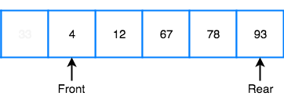

# 2-2. 스택과 큐

자료들을 선형적으로 저장하는 자료구조

### 목차
- [스택](#스택)
	+ [term](#term)
	+ [스택이 쓰인 예시](#스택이-쓰인-예시)
- [큐](#큐)
    + [term](#term)
    + [linear queue](#linear-queue)
    + [circular queue](#circular-queue)
- [Palindrome check](#Palindrome-check)

## 스택

- `LIFO` 특성을 가지는 자료구조

### term

- `top`
- push
- pop
    - `LIFO` 이므로 push, pop은 top에서만 이뤄진다.

### 스택이 쓰인 예시

- parenthesis matching

## 큐

- `FIFO` 특성을 가지는 자료구조

### term

- `front (head)`
- `rear (back, tail)`
- enqueue
    - rear (back, tail) 에서 발생 - insertion
- dequeue
    - front (head) 에서 발생 - deletion

### linear queue


__https://www.codingninjas.com/codestudio/library/advantages-of-circular-queue-over-linear-queue__

→ enqueue, dequeue 를 반복하다보면 `rear` 가 array의 끝을 가르키고 있기 때문에, 앞에 1개의 공간이 있음에도 더 이상 데이터를 insertion할 수 없는 상황이 생긴다. 

### circular queue

- `rear`, `front` index를 이용해서 linear queue 보다 공간을 더 잘 활용할 수 있는 형태

→ 큐는 논리적으로는 선형자료구조이나, 공간을 다 활용하기 위해 동그랗게 말린 형태로 구현한다.

### Palindrome check

```cpp
#include <cstring>
#include <stack>
#include <queue>

bool Check_Palindrome(const char *__str)
{
	std::stack<char> s;
	std::queue<char> q;

	int len = strlen( __str );
	for (int i = 0; i < len; i++) 
	{
		s.push( __str[i] );
		q.push( __str[i] );
	}

	while( !s.empty() )
	{
		if( s.top()  != q.front() )
			return false;
		s.pop();
		q.pop();
	}
}
```
