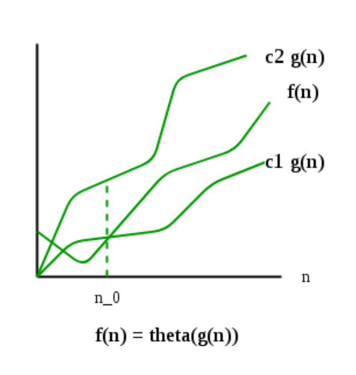

# 심볼 기반 함수의 점근적 바운드

- 알고리즘의 complexity를 표현할 수 있는 여러 가지 notation들
  
### 목차
- [theta notation](#theta-notation)
- [O notation](#O-notation)
- [omega notation](#omega-notation)
- [가장 흔히 사용하는 notation](가장-흔히-사용하는-notation)
    
    
    

## theta notation

[https://www.geeksforgeeks.org/analysis-of-algorithms-set-3asymptotic-notations/](https://www.geeksforgeeks.org/analysis-of-algorithms-set-3asymptotic-notations/)

- f(n) = `theta` of g(n)
    - g(n) = `asymptotically tight bound` for f(n)
    - f(n) ‘s `rate of growth` = g(n) ‘s `rate of growth`
    

## O - notation

- f(n) = `big-oh` of g(n)
    - $0 <= f(n) <= c*g(n)$
    - g(n) = `asymptotically upper bound` for f(n)
- 알고리즘의 worst case 러닝 타임을 얘기할 때 유용하다.

## omega notation

- g(n) = `asymptotically lower bound` for f(n)
- 알고리즘의 best case 러닝 타임을 얘기할 때 유용하다.

## 가장 흔히 사용하는 notation

- theta notation
    - `tight boundary` 이기 때문에 정확하게 이 알고리즘의 런타임을 얘기할 수 있다.
- big-o notation
    - 일반적으로 `worst case complexity` 를 비교하기 때문에 유용하다.
